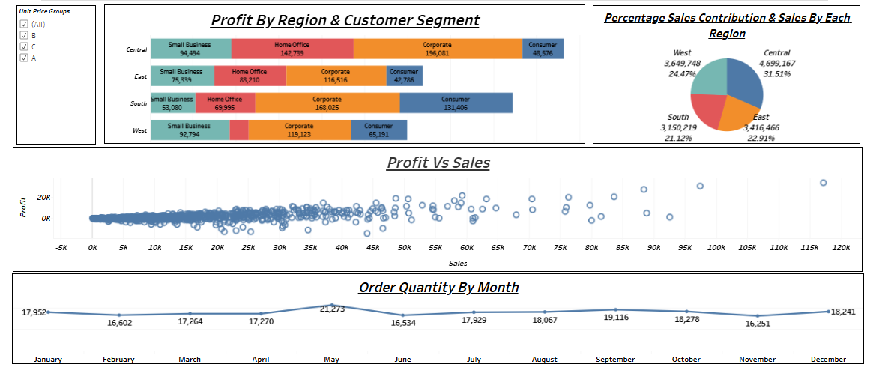

# Sales & Profit Analysis Dashboard (Tableau)

## 📊 Project Overview
This project showcases an interactive **Sales & Profit Analysis Dashboard** built using Tableau.  
The dashboard analyzes sales performance, profitability, customer segments, and regional trends to support data-driven business decision-making.

## 🔍 Key Insights Covered
- Profit distribution across **Regions and Customer Segments**
- **Percentage contribution of sales** by region
- Relationship between **Sales and Profit**
- Monthly trend analysis of **Order Quantity**
- Comparative performance of regions (West, East, Central, South)

## 📈 Dashboard Components
1. **Profit by Region & Customer Segment**  
   Displays how different customer segments (Consumer, Corporate, Home Office, Small Business) contribute to profit across regions.

2. **Sales Contribution by Region**  
   Pie chart visualizing region-wise sales contribution in percentage terms.

3. **Profit vs Sales Analysis**  
   Scatter plot highlighting the relationship between sales and profit, helping identify high-performing and low-performing orders.

4. **Order Quantity by Month**  
   Line chart showing monthly order trends to identify seasonality and demand patterns.

## 🛠 Tools & Technologies
- **Tableau** – Data visualization and dashboard development  
- **CSV / Excel** – Sales dataset  
- **GitHub** – Project documentation and version control  

## 📸 Dashboard Preview

## 🚀 How to View the Dashboard
- **Tableau Public:**  
  https://public.tableau.com/app/profile/pranay.birangade/viz/SalesDashboard_17702909896900/Dashboard1?publish=yes

## 📁 Files in This Repository
- `Sales Dashboard.twbx` – Tableau packaged workbook  
- `Dashboard_Screenshot.png` – Dashboard preview  
- `Dataset/` – Sales data used for analysis  
- `README.md` – Project documentation  

